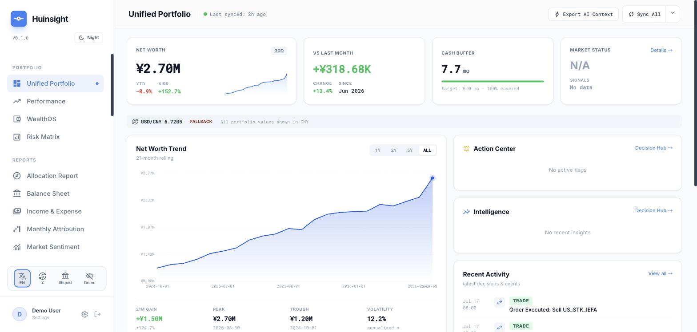
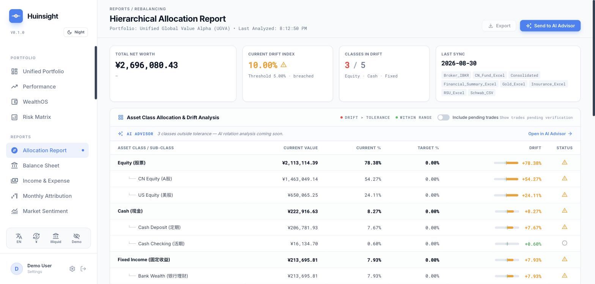
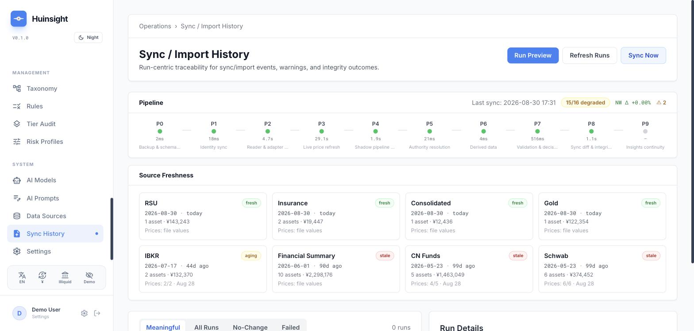

# Huinsight

**慧眼 (Huìyǎn) — the discerning eye.**

The self-hosted portfolio tracker for people whose money doesn't stay in one country.

[Quickstart](docs/quickstart.md) · [Adding a source](docs/adding-a-source.md) · [Operations](docs/operations.md) · [中文](README.zh-CN.md)

[](https://github.com/SunnRayy/huinsight/actions/workflows/ci.yml)
[](LICENSE)
[](docs/quickstart.md)
[](ux-command-center)

Huinsight pulls holdings and transactions from seven sources — US brokerages,
Chinese mutual funds, insurance, gold, pension, employer equity — into one local
DuckDB database, then runs full portfolio analytics on top: net worth, allocation
drift, TWR/XIRR, lifetime FIFO gains, cash-flow forecasting, and more.

**It won't show you a number it can't verify.** Sixteen integrity checks run after
every sync; an unreadable data source fails loudly instead of quietly reporting
zero; every holding has exactly one authoritative source, so nothing gets
double-counted.

An optional AI layer records verifiable, timestamped decisions rather than
one-off chat answers. It is off by default and needs your own LLM API key.

Self-hosted and single-user by design. No signup, no third party holding your
data — one deployment serves exactly one person.

**Honest limitation, up front**: CNY is the reporting currency architecturally
today. If your assets are USD-only, you will still see CNY-denominated output.
See [Honest limitations](#honest-limitations) for the rest.

**Try it in ~10 minutes on synthetic demo data, no real financial information
required:** [`docs/quickstart.md`](docs/quickstart.md).

---



## What it does

Seven data readers (Schwab, IBKR, CN mutual funds, gold, insurance, RSU
vests, and a manually-maintained financial summary spreadsheet) feed into a
single DuckDB database. On top of that:

- **Portfolio analytics** — net worth, TWR/XIRR, FIFO cost basis, P&L
  attribution, risk metrics (Sharpe/Sortino/VaR), balance sheet, cash-flow
  forecasting, rebalancing guidance.
- **A data-accuracy layer** — 16 post-sync integrity invariants, a
  fail-closed doctrine (an unreadable/missing source degrades rather than
  silently reporting zero), and a reader-first authority model so every
  holding has exactly one owner.
- **An optional AI decision-support loop** — record a trade → generate an
  LLM-written brief → review the outcome → distill a reusable insight, with
  verdict scoring. This needs an LLM API key; the rest of the app works
  fully without one.

### The reader-first authority model

The readers are the only source of truth for current holdings. Everything
else — live price feeds, the AI advisor, historical baselines — is a
non-authoritative enrichment layer that can never overwrite a reader's
holding. Concretely: a broker CSV always wins over a cached price, and a
price-refresh job updates `market_value` only, never quantity or cost basis.

```
Readers (source of truth for holdings)
   │  Schwab · IBKR · CN Fund · Gold · Insurance · RSU · Financial Summary
   ▼
DuckDB (single file) ──▶ 16-check integrity gate ──▶ FastAPI ──▶ React UI
   ▲
   │  enrichment only — never owns a holding
Price-refresh layer (yfinance, AkShare, gold spot) · AI Advisor context layer
```

All `market_value` is stored in CNY; P&L is computed in each asset's native
currency and converted once at display time, so FX movement never distorts
a stable-currency holding's return. (See Limitations below — CNY-as-base is
architectural, not configurable, today.)

---

## Adding your own data source

If your broker or asset type isn't one of the built-in readers, you don't
need to modify this codebase to add it — a new source is two files (a
declarative YAML + one Python function), both living outside `src/sources/`.
Walkthrough, with a complete working example: [`docs/adding-a-source.md`](docs/adding-a-source.md).

---

## Honest limitations

This section exists because a README that only lists what works isn't
useful for deciding whether to adopt something.

- **CNY is the base currency, architecturally, not a config option.**
  ~360 references across the codebase assume `market_value` is stored in
  CNY. Multi-base-currency support (USD-base, EUR-base, etc.) is a real
  contribution opportunity — the architecture doesn't forbid it, nobody has
  built it — but it isn't a settings toggle today. If your reporting
  currency isn't CNY, expect to either accept CNY-denominated output or take
  on that work yourself.
- **Localization is UI + setup docs, not the whole stack.** The React UI
  (93 files, 2,753 catalog keys across `ux-command-center/src/i18n/locales/{en,zh-CN}/`),
  this README, `docs/quickstart.md`, `docs/operations.md`, and AI-advisor
  output all support English and Simplified Chinese (`language: en | zh-CN`
  in `config/settings.example.yaml`). By design, the following stay
  English-only: backend API error messages, the sync log stream,
  integrity-check messages, and the `main.py` CLI. That's not an oversight —
  it's a deliberate line between what a self-hosted single operator reads in
  a browser (localized) and what a developer/operator reads in a terminal or
  log (English, so it's greppable and matches upstream error text).
- **Source-specific ingest normalization lives in a growing if/elif ladder**
  (`src/sync/phases/_ingest.py`), not in each reader's own contract. It
  works, and a new source doesn't need to touch it (see
  `docs/adding-a-source.md`), but it's exactly the kind of thing that gets
  harder to reason about as sources are added. See
  [`docs/design-retrospective.md`](docs/design-retrospective.md) for what a
  cleaner shape would look like.
- **Six analytics surfaces used to independently recompute P&L** before a
  2026 refactor unified them into one engine (`src/services/pnl/`) — the
  single-engine version is what ships today, but the retrospective covers
  why that took a dedicated migration rather than being the design from day
  one, because the same trap is easy to reintroduce.
- **DuckDB never shrinks on its own** — see
  [`docs/operations.md`](docs/operations.md) for why, and the compaction
  routine that handles it. Not a bug, but worth knowing before you assume a
  database file's size tells you anything about your actual data volume.
- **Frontend test suite: 246/274 passing.** The 28 failures are test-vs-component
  drift (a component's UI or API contract moved since its test was written),
  not app breakage — the app itself was verified working end-to-end in a real
  browser, independently of this suite's state. `docs/design-retrospective.md`
  has the per-file breakdown; several entries are scoped enough to be a first
  PR. Run `cd ux-command-center && npm test` yourself — the numbers here should
  match what you see.
- **One backend test is a known parallel-execution flake.**
  `tests/api/test_risk_endpoints.py::test_risk_correlation_returns_matrix`
  occasionally 503s under the full `pytest tests/ -n auto` run but passes
  clean standalone (verified: `pytest tests/api/test_risk_endpoints.py -q`
  → 2 passed) — DuckDB-lock contention under parallel workers, not a
  regression. If you see it, rerun the file alone or with `-n 0` before
  assuming something's broken.
- **Single-maintainer project.** Response time on issues/PRs will vary.

---

## Quickstart

Requires Python 3.9–3.13 (tested on 3.9.6 and 3.13.7).

```bash
git clone https://github.com/SunnRayy/huinsight && cd huinsight
python3 -m venv .venv && .venv/bin/pip install -r requirements.txt
cd ux-command-center && npm install && cd ..

.venv/bin/python tools/demo_data/generate.py   # synthetic demo data, no real data needed
find tools/demo_data/out -type f | wc -l       # must say 9 before continuing — see quickstart.md if not
mkdir -p data/import
cp tools/demo_data/out/*.csv tools/demo_data/out/*.xlsx data/import/
cp tools/demo_data/out/ibkr/*.csv tools/demo_data/out/ibkr_trades/*.csv data/import/
cp config/settings.example.yaml config/settings.yaml

.venv/bin/python main.py --init
.venv/bin/python main.py --sync-v3
./dev.sh start
```

Full walkthrough with explanations: [`docs/quickstart.md`](docs/quickstart.md).
Deploying to a persistent Cloud Run instance instead of running locally:
[`docs/deployment-instructions.md`](docs/deployment-instructions.md).

---

Allocation and drift, resolved through the asset-class taxonomy — every holding
placed, nothing dumped into "Unclassified":



Every sync is traceable: per-phase timings, the integrity result, and how stale
each source is — an aging or stale reader says so rather than quietly reporting
its last known value as current.



## Data accuracy

```bash
python main.py --check-integrity        # 16 invariant checks, auto-run after every sync
python main.py --check-integrity --json # CI-friendly; non-zero exit on a blocking failure
```

16 integrity invariants (`src/validation/data_integrity_gate.py`) split
into blocking checks (a failure marks the sync unsuccessful) and advisory
checks (surfaced but don't fail the run). Key rules, full list in
[`AGENTS.md`](AGENTS.md):

- All `market_value` stored in CNY; native-currency P&L converted once at
  display time.
- Never use a global `MAX(snapshot_date)` — always per-asset or per-source.
  A global max silently treats a slow-reporting asset as stale.
- Reader rows never carry `is_shadow=TRUE` — that flag is reserved for the
  historical-baseline layer, never a live reader.

Beyond runtime checks, `scripts/verify.sh` (exit `0`/`1`/`2`/`3`) enforces
static invariants at commit time, including a doc-freshness check that
derives canonical values (integrity-check count, rule count, version) from
their source of truth and fails if a doc has drifted from the code.

**Database safety**: `data/unified.duckdb` has no version control.
Schema-recreating commands (`--init`, `DROP`, `DELETE`) are treated as
destructive by convention — see [`AGENTS.md`](AGENTS.md) for the full rules
this project holds itself to (originally written for AI coding agents, but
they're the project's actual data-correctness invariants regardless of who's
writing the patch).

---

## Feature map

The frontend is organized into three domains.

**Portfolio analytics** — Dashboard (net-worth KPIs), Compass (allocation
drift + rebalance guidance), Performance (TWR/XIRR/attribution/risk),
WealthOS (lifetime FIFO gain), Risk Matrix (correlation), Balance Sheet /
Income-Expense, cash-flow forecasting, Market Sentiment (macro indicators),
Valuation (per-asset signals).

**AI decision intelligence** *(optional — needs an LLM API key)* — AI
Advisor (brief / memos / trade recording / technical analysis / review /
insights), Decision Hub (unified timeline + verdict scorecards), loss-side
value-trap reviews, North Star (contribution/glide-path tracking),
Strategy Alignment, Verification (per-trade + adoption-rate tracking).

**Operations & governance** — sync audit trail, per-asset event history,
Import Workbench, transaction browser, taxonomy/classification management,
risk-profile targets, data-source settings.

---

## Tech stack

**Backend**: Python · FastAPI · DuckDB · pandas
**Frontend**: React · TypeScript · Vite · Recharts · Tailwind
**Market data**: yfinance · AkShare · FRED
**Deploy**: Docker · Google Cloud Run · GCS (DuckDB persistence) · GitHub Actions

---

## Contributing

See [`CONTRIBUTING.md`](CONTRIBUTING.md). Security issues:
[`SECURITY.md`](SECURITY.md) (please don't file those as public issues).
[`docs/design-retrospective.md`](docs/design-retrospective.md) is both an
honest account of what this codebase got right and wrong over its
development, and the closest thing to a contribution roadmap this project
has.

## License

MIT — see [`LICENSE`](LICENSE).
