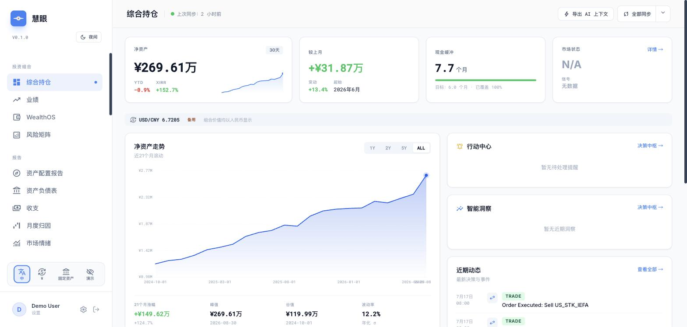

[English](README.md) | 简体中文

# 慧眼 Huinsight

**慧眼——看得清，才敢下判断。**

写给资产不只待在一个国家的人的自托管投资组合追踪器。

[快速开始](docs/quickstart.zh-CN.md) · [添加数据源](docs/adding-a-source.md) · [运维](docs/operations.zh-CN.md) · [English](README.md)

[](https://github.com/SunnRayy/huinsight/actions/workflows/ci.yml)
[](LICENSE)
[](docs/quickstart.zh-CN.md)
[](ux-command-center)

慧眼把七个来源的持仓与交易——美股券商、境内公募基金、保险、黄金、养老金、
公司股票归属——汇进一个本地 DuckDB 数据库，并在其上跑完整的组合分析：净资产、
配置偏离、TWR/XIRR、终身 FIFO 盈亏、现金流预测等。

**它不会显示一个自己无法验证的数字。** 每次同步后运行 16 项完整性校验；数据源
读不出来时会明确报错，而不是悄悄记成零；每个持仓有且只有一个权威来源，所以不会
被重复计算。

可选的 AI 层记录的是可核验、带时间戳的决策，而不是一次性的对话回答。默认关闭，
需要你自己的 LLM API key。

自托管、单用户设计。没有注册，没有第三方持有你的数据——一次部署只服务一个人。

**先说清楚一个局限**：目前 CNY 是架构层面的记账货币。如果你的资产全是美元，
看到的仍会是以人民币计价的输出。其余局限见[诚实的局限性](#诚实的局限性)。

**用合成的演示数据，约 10 分钟即可体验，无需提供任何真实财务信息：**
[`docs/quickstart.zh-CN.md`](docs/quickstart.zh-CN.md)。

---



## 它能做什么

七个数据源（Schwab、IBKR、境内公募基金、黄金、保险、RSU 归属，以及一份
手动维护的财务汇总表）汇入同一个 DuckDB 数据库。在此基础上：

- **投资组合分析**——净资产、TWR（时间加权收益率）/XIRR（资金加权收益率）、
  FIFO 持仓成本、盈亏归因、风险指标（Sharpe / Sortino / VaR）、资产负债表、
  现金流预测、再平衡指引。
- **数据准确性层**——同步后运行 16 项完整性不变量检查，遵循「失败即保守」
  （fail-closed）原则（数据源不可读或缺失时，结果会降级而不是悄悄显示为零），
  并采用数据源优先的权威模型，确保每笔持仓都只有一个权威归属。
- **可选的 AI 决策辅助闭环**——记录一笔交易 → 生成一份 LLM 撰写的简报 →
  复盘结果 → 提炼出可复用的经验，并附带准确度评分。此功能需要一个 LLM
  API key；应用的其余部分完全不依赖它也能正常使用。

### 数据源优先的权威模型

对于当前持仓，数据源是唯一的权威来源（source of truth）。其他一切——
实时行情、AI 顾问、历史基线——都是不具权威性的补充层，永远不能覆盖某个
数据源的持仓数据。具体来说：券商 CSV 的数据始终优先于缓存价格，行情刷新
任务只会更新 `market_value`，绝不会更新数量或持仓成本。

```
Readers (source of truth for holdings)
   │  Schwab · IBKR · CN Fund · Gold · Insurance · RSU · Financial Summary
   ▼
DuckDB (single file) ──▶ 16-check integrity gate ──▶ FastAPI ──▶ React UI
   ▲
   │  enrichment only — never owns a holding
Price-refresh layer (yfinance, AkShare, gold spot) · AI Advisor context layer
```

所有 `market_value` 均以 CNY 存储；盈亏按各资产的原始币种计算，仅在展示时
转换一次，因此汇率波动不会扭曲一笔币值稳定资产的收益表现。（参见下方
「诚实的局限性」——目前以 CNY 为基准币种是架构层面的设定，而非可配置项。）

---

## 添加你自己的数据源

如果你的券商或资产类型不在内置数据源之列，你不需要修改这个代码库就能
添加它——一个新数据源只需要两个文件（一份声明式 YAML + 一个 Python
函数），二者都位于 `src/sources/` 之外。完整的可运行示例见
[`docs/adding-a-source.md`](docs/adding-a-source.md)（英文）。

---

## 诚实的局限性

写这一节，是因为一份只罗列「能做什么」的 README，对判断「值不值得采用」
没什么帮助。

- **CNY 是基准币种，这是架构层面的设定，不是配置选项。** 代码库中约 360
  处引用都假定 `market_value` 以 CNY 存储。支持多基准币种（USD 基准、EUR
  基准等）是一个真实存在的贡献机会——架构本身并不禁止，只是还没有人做——
  但目前它不是一个设置开关。如果你的报表币种不是 CNY，要么接受以 CNY 计价
  的输出，要么自己动手实现这项工作。
- **本地化覆盖的是界面 + 安装文档，不是整个技术栈。** React 界面（93 个
  文件、`ux-command-center/src/i18n/locales/{en,zh-CN}/` 下共 2,753 个
  词条）、这份 README、`docs/quickstart.md`、`docs/operations.md`，以及
  AI 顾问的输出，都支持英文和简体中文（`config/settings.example.yaml` 中的
  `language: en | zh-CN`）。以下部分则按设计保持英文：后端 API 错误信息、
  同步日志流、完整性检查（integrity-check）提示信息，以及 `main.py`
  命令行工具。这不是遗漏——而是有意划出的一条界线：单用户在浏览器里读到的
  内容（本地化），和开发者/运维在终端或日志里读到的内容（保持英文，便于
  grep，也与上游报错文本保持一致）。
- **按数据源做的接入归一化逻辑，目前是一段不断增长的 if/elif 链**
  （`src/sync/phases/_ingest.py`），而不是每个数据源自身契约的一部分。
  它能正常工作，新增数据源也不需要改动它（见
  `docs/adding-a-source.md`），但随着数据源增多，这类代码天然会越来越难
  推理。更简洁的设计方向见
  [`docs/design-retrospective.md`](docs/design-retrospective.md)（英文）。
- **曾有六个分析模块各自独立重新计算盈亏**，直到 2026 年的一次重构把它们
  统一进了一个引擎（`src/services/pnl/`）——今天上线的就是这个单引擎版本，
  但那份复盘文档记录了为什么这需要一次专门的迁移，而不是从第一天起就这样
  设计，因为同样的陷阱很容易被重新引入。
- **DuckDB 不会自动收缩**——原因和处理它的压缩流程见
  [`docs/operations.zh-CN.md`](docs/operations.zh-CN.md)。这不是 bug，但
  在你把数据库文件大小当作实际数据量的信号之前，值得了解一下。
- **前端测试套件：246/274 通过。** 这 28 个失败属于「测试与组件不同步」
  （组件的界面或 API 约定变了，但对应的测试没跟上），不是应用本身出了问题
  ——应用本身已经在真实浏览器中做过端到端验证，与这个测试套件当前的状态
  无关。`docs/design-retrospective.md` 有逐文件的明细；其中几项范围明确，
  适合作为第一个 PR。自己跑一下 `cd ux-command-center && npm test`——这里
  的数字应该和你看到的一致。
- **有一个后端测试是已知的并行执行 flake（偶发失败）。**
  `tests/api/test_risk_endpoints.py::test_risk_correlation_returns_matrix`
  在完整的 `pytest tests/ -n auto` 并行运行下偶尔会报 503，但单独运行时是
  干净通过的（已验证：`pytest tests/api/test_risk_endpoints.py -q` →
  2 passed）——这是并行 worker 下的 DuckDB 锁争用，不是回归问题。如果你
  遇到了，先单独重跑这个文件，或加 `-n 0`，再判断是不是真的坏了。
- **单一维护者项目。** issue/PR 的响应速度会有波动。

---

## 快速开始

需要 Python 3.9–3.13（已在 3.9.6 和 3.13.7 上测试过）。

```bash
git clone https://github.com/SunnRayy/huinsight && cd huinsight
python3 -m venv .venv && .venv/bin/pip install -r requirements.txt
cd ux-command-center && npm install && cd ..

.venv/bin/python tools/demo_data/generate.py   # synthetic demo data, no real data needed
find tools/demo_data/out -type f | wc -l       # must say 9 before continuing — see quickstart.md if not
mkdir -p data/import
cp tools/demo_data/out/*.csv tools/demo_data/out/*.xlsx data/import/
cp tools/demo_data/out/ibkr/*.csv tools/demo_data/out/ibkr_trades/*.csv data/import/
cp config/settings.example.yaml config/settings.yaml

.venv/bin/python main.py --init
.venv/bin/python main.py --sync-v3
./dev.sh start
```

带完整说明的完整流程：[`docs/quickstart.zh-CN.md`](docs/quickstart.zh-CN.md)。
如果你想部署到一个持续运行的 Cloud Run 实例，而不是在本地跑：
[`docs/deployment-instructions.md`](docs/deployment-instructions.md)（英文）。

---

## 数据准确性

```bash
python main.py --check-integrity        # 16 invariant checks, auto-run after every sync
python main.py --check-integrity --json # CI-friendly; non-zero exit on a blocking failure
```

16 项完整性不变量检查（`src/validation/data_integrity_gate.py`）分为
阻断性检查（失败会将本次同步标记为不成功）和提示性检查（会展示出来，
但不会让本次运行失败）。核心规则，完整列表见
[`AGENTS.md`](AGENTS.md)（英文）：

- 所有 `market_value` 均以 CNY 存储；原始币种下的盈亏只在展示时转换一次。
- 绝不使用全局的 `MAX(snapshot_date)`——始终按单个资产或单个数据源取值。
  用全局最大值会悄悄把一个更新较慢的资产误判为「陈旧」（stale）。
- 数据源写入的记录永远不会带 `is_shadow=TRUE`——这个标记只保留给历史基线
  层，绝不用于实时数据源。

除了运行时检查之外，`scripts/verify.sh`（退出码 `0`/`1`/`2`/`3`）在提交
时还会强制执行一批静态不变量检查，其中包括一项文档新鲜度检查——它会从
代码这个「真源」推导出规范值（完整性检查数量、规则数量、版本号），一旦
某份文档与代码脱节就会失败。

**数据库安全**：`data/unified.duckdb` 没有版本控制。按惯例，会重建 schema
的命令（`--init`、`DROP`、`DELETE`）都被视为具有破坏性——完整规则见
[`AGENTS.md`](AGENTS.md)（英文；最初是为 AI 编程 agent 写的，但这些其实是
这个项目自身对数据正确性的硬性要求，无论写补丁的是谁都一样适用）。

---

## 功能地图

前端划分为三大板块。

**投资组合分析**——Dashboard（净资产核心指标）、Compass（资产配置报告：
配置偏离 + 再平衡指引）、Performance（业绩：TWR/XIRR/归因/风险）、
WealthOS（全生命周期 FIFO 收益）、Risk Matrix（风险矩阵：相关性分析）、
Balance Sheet（资产负债表）/ Income-Expense（收支）、现金流预测、
Market Sentiment（市场情绪：宏观指标）、Valuation（估值：单资产信号）。

**AI 决策智能***（可选——需要 LLM API key）*——AI Advisor（AI 顾问：简报 /
备忘录 / 交易记录 / 技术分析 / 复盘 / 洞察）、Decision Hub（决策中枢：
统一时间线 + 准确度评分卡）、亏损侧价值陷阱复盘、North Star（贡献度 /
达成路径追踪）、Strategy Alignment（策略对齐）、Verification（核验：
逐笔交易 + 采纳率追踪）。

**运营与治理**——同步审计轨迹、逐资产事件历史、导入工作台、交易浏览器、
分类体系/分类管理、风险偏好配置目标、数据源设置。

---

## 技术栈

**后端**：Python · FastAPI · DuckDB · pandas
**前端**：React · TypeScript · Vite · Recharts · Tailwind
**行情数据**：yfinance · AkShare · FRED
**部署**：Docker · Google Cloud Run · GCS（DuckDB 持久化存储）· GitHub Actions

---

## 贡献

见 [`CONTRIBUTING.md`](CONTRIBUTING.md)（英文）。安全问题请见
[`SECURITY.md`](SECURITY.md)（英文；请不要以公开 issue 的形式提交安全问题）。
[`docs/design-retrospective.md`](docs/design-retrospective.md)（英文）
既是对这个代码库在开发过程中做对和做错的地方的坦诚记录，也是这个项目
最接近「贡献路线图」的一份文档。

## 许可证

MIT——见 [`LICENSE`](LICENSE)。
