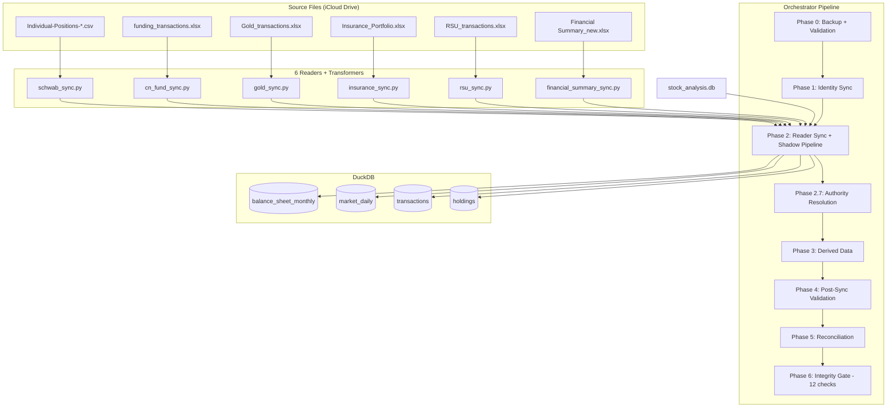

# Data Sources — V4.3.1 Reference

> **Version**: V4.3.1 — 2026-03-20
> **Previous doc**: `docs/archive/data-sources-original-2026-01-25.md` (V1 — PIS/AIA/DSA only)

---

## Overview

The Huinsight aggregates holdings from **6 reader sources** plus one market data
provider. PIS (Personal Investment System) is deprecated as an active source and retained as a
historical baseline only.

AI Advisor Brief / Review is a downstream consumer of these sources. It must reuse shared
portfolio semantics derived from the same authoritative holdings / balance-sheet / market tables,
rather than introducing a separate prompt-only interpretation of allocations or performance.

| # | Source | Type | Asset Coverage | Canonical ID Prefix |
|---|--------|------|----------------|-------------------- |
| 1 | Schwab CSV | Real-time reader | US stocks, ETFs, USD cash | `US_STK_*`, `CASH_USD` |
| 2 | CN Fund Excel | Real-time reader | Chinese mutual funds | `CN_FUND_*` |
| 3 | Gold Excel | Real-time reader | Paper gold (all accounts) | `ALTS_Paper_Gold` |
| 4 | Insurance Excel | Real-time reader | Insurance policies | `INS_*` |
| 5 | RSU Excel | Derived reader | Amazon RSUs | `RSU_AMZN` |
| 6 | Financial Summary Excel | Historical reader | Deposits, property, pension, cash | `Property_*`, `Pension_*`, `CASH_Deposit_*`, `Wealth_CMB`, `CASH_CNY` |
| 7 | DSA | Market data | OHLCV for all tradeable assets | N/A (enriches existing holdings) |
| 8 | PIS | Deprecated (historical) | All asset types (legacy baseline) | Varies |

### AI Advisor Integration Notes

AI Advisor consumes the following data products:

- **Current allocation / target / drift**: shared Compass semantics via `src/services/compass_allocation.py`
- **Portfolio performance / risk summary**: shared Performance semantics via `src/services/portfolio_semantics.py`
- **Detailed holdings**: shared WealthOS active-holdings semantics via `src/services/portfolio_semantics.py`
- **Transactions / review flows**: `trade_logs` plus AI review Q&A context
- **LLM execution**: `src/services/llm_client.py` with prompt templates in `src/services/ai_advisor/prompts.py`

This keeps AI Advisor aligned with the same reader-first data contracts already used by Compass,
Performance, and WealthOS.

---

## Source 1: Schwab CSV

**Files**: `src/sources/schwab_reader.py`, `src/sources/schwab_transformer.py`, `src/sources/schwab_sync.py`

### Artifacts

| Artifact | Pattern | Notes |
|----------|---------|-------|
| Holdings | `Individual-Positions-*.csv` | Latest file only; no archive processing |
| Transactions | `Individual_*_Transactions_*.csv` | All available transaction history |

### Key Behaviors

- **Currency conversion**: All values multiplied by `USD_TO_CNY` (7.0) at transformer level
- **Per-unit cost**: Schwab exports total cost basis; transformer divides by quantity
- **Cash extraction**: Cash balance row in positions CSV → `CASH_USD` holding
- **ETF remap**: `US_ETF_*` canonical IDs → `US_STK_*` at insertion (DuckDB stores only `US_STK_*`)
- **Reads latest file only**: Unlike some readers that can process archives, Schwab reader selects the newest CSV by filename date

### Authority

`config/source_authority.yaml`:
- `US_STK_*`, `US_ETF_*`, `CASH_USD` → `Schwab_CSV` (priority 8)

---

## Source 2: CN Fund Excel

**Files**: `src/sources/cn_fund_reader.py`, `src/sources/cn_fund_transformer.py`, `src/sources/cn_fund_sync.py`

### Artifacts

| Artifact | Pattern | Notes |
|----------|---------|-------|
| Main file | `funding_transactions.xlsx` | Contains both processed and raw transaction tabs |

### Key Behaviors

- **Processed tab**: Reader reads the "processed" worksheet for clean, normalized data
- **Raw processor**: For unprocessed worksheets, a raw processor normalizes column names
- **Currency**: Already CNY — no conversion needed
- **FIFO cost**: Derived post-insertion via `_backfill_fifo_cost_basis()` from transaction history

### Authority

`config/source_authority.yaml`:
- `CN_FUND_*` → `CN_Fund_Excel` (priority 8)

---

## Source 3: Gold Excel

**Files**: `src/sources/gold_reader.py`, `src/sources/gold_transformer.py`, `src/sources/gold_sync.py`

### Artifacts

| Artifact | Pattern | Notes |
|----------|---------|-------|
| Main file | `Gold_transactions.xlsx` | Contains per-account gold positions and transactions |

### Key Behaviors

- **Per-account holdings**: Reader returns one row per gold account (bank A, bank B, etc.)
- **Aggregation**: `_aggregate_gold_holdings()` in orchestrator sums per-account rows → single `ALTS_Paper_Gold` row
- **Account breakdown**: Logged to `sync_audit_logs` with `conflict_type="gold_rollup"` for reconciliation
- **Currency**: Already CNY

### Authority

`config/source_authority.yaml`:
- `ALTS_Paper_Gold`, `GOLD_*` → `Gold_Excel` (priority 8)

---

## Source 4: Insurance Excel

**Files**: `src/sources/insurance_reader.py`, `src/sources/insurance_transformer.py`, `src/sources/insurance_sync.py`

### Artifacts

| Artifact | Pattern | Notes |
|----------|---------|-------|
| Main file | `Insurance_Portfolio.xlsx` | Contains current holdings and premium payment history |

### Key Behaviors

- **Holdings sheet**: `保险汇总` (Insurance Summary) — current cash value per policy
- **Market value**: Uses `cash_value` column (surrender value), not face value
- **Premium payments**: Read from `保费记录` sheet (wide-to-long melt via pandas)
- **Cost basis**: Set post-insertion by `_set_insurance_cost_from_premiums()`:
  - `cost_price_unit` = cumulative sum of all premium payments
  - `quantity` = 1
- **P&L**: Represents actual return on insurance investment (cash value vs premiums paid)

### Authority

`config/source_authority.yaml`:
- `INS_*` → `Insurance_Excel` (priority 8)

---

## Source 5: RSU Excel

**Files**: `src/sources/rsu_reader.py`, `src/sources/rsu_transformer.py`, `src/sources/rsu_sync.py`

### Artifacts

| Artifact | Pattern | Notes |
|----------|---------|-------|
| Main file | `RSU_transactions.xlsx` | Vest events and sell transactions |

### Key Behaviors

- **Holdings are derived**: RSU reader does NOT read current holdings directly. It reads vest
  and sell transactions, then computes `net_qty = sum(vested) - sum(sold)` per ticker
- **Market value**: `net_qty × vest_price × USD_TO_CNY` at time of computation
- **Cost basis = vest price**: The vest price is the taxable income reported to IRS, used as
  cost basis. This intentionally diverges from PIS (which uses 0)
- **Price update**: Post-insertion, `_update_rsu_prices_from_external_sources()` in
  `src/sync/orchestrator.py` updates `market_price_unit` using:
  (1) yfinance via `src/market_data/fetchers/yfinance_fetcher.py` (primary),
  (2) Financial Summary Excel fallback.
  Changed from AIA JSON to yfinance at V5.2.1 — see Change Log at end of file.

### Authority

`config/source_authority.yaml`:
- `RSU_*` → `RSU_Excel` (priority 5)

---

## Source 6: Financial Summary Excel

**Files**: `src/sources/financial_summary_reader.py`, `src/sources/financial_summary_transformer.py`, `src/sources/financial_summary_sync.py`

### Artifacts

| Artifact | Pattern | Notes |
|----------|---------|-------|
| Main file | `Financial Summary_new.xlsx` | Balance sheet + income/expense monthly |

### Key Behaviors

- **`melt_balance_sheet_to_holdings()`**: Extracts 10 discrete assets from balance sheet rows
- **Assets extracted**:

  | Asset ID | Description |
  |----------|-------------|
  | `CASH_Deposit_RMB_1` | RMB time deposit #1 |
  | `CASH_Deposit_RMB_2` | RMB time deposit #2 |
  | `CASH_Deposit_RMB_3` | RMB time deposit #3 |
  | `CASH_Deposit_USD_1` | USD time deposit #1 |
  | `CASH_Deposit_USD_2` | USD time deposit #2 |
  | `CASH_Deposit_USD_3` | USD time deposit #3 |
  | `CASH_CNY` | Cash in CNY |
  | `Property_Home` | Primary residence |
  | `Wealth_CMB` | Bank wealth management product |
  | `Pension_CNY` | Pension account balance |

- **Historical snapshots**: Data goes back to 2019. All are inserted; only latest per asset
  is active (`is_shadow=FALSE`)
- **Shadow direction**: `_shadow_stale_historical_holdings()` keeps only the latest snapshot
  per asset active
- **Balance sheet tables**: `balance_sheet_monthly`, `income_expense_monthly` are also
  populated from this source for trend analysis

### Authority

Financial Summary assets use the catch-all PIS rule (priority 100) since no other reader
covers `Property_*`, `Pension_*`, `CASH_Deposit_*`, `Wealth_CMB`.

---

## Source 7: DSA (Daily Stock Analysis — Market Data)

**Files**: `src/sync/dsa_sync.py`

**External system**: an optional companion market-data pipeline the owner runs
separately (not part of this repo) — a local SQLite path, configured per
install.

### Key Behaviors

- **Data**: OHLCV data from `stock_analysis.db` (SQLite)
- **Tables populated**: `market_daily` in DuckDB
- **Market regime codes**: Stores index codes like `"110020"`, `"900011"`, `"000300"` (not `"CSI300"` or `"SPY"`)
- **Does NOT create holdings**: Only enriches existing holdings with current prices

---

## Source 8: PIS (Personal Investment System — Deprecated)

**External system**: the owner's PIS Legacy repo (a separate, private codebase — not part of this repo)

> **Status**: Deprecated as active source. See `docs/decisions/ADR-003-phase9-pis-deprecation.md`.

### Why Deprecated

| Issue | Impact |
|-------|--------|
| Phantom transactions | PIS auto-generates `Adjustment_Buy` to reconcile gaps — pollutes FIFO |
| Schwab cash bug | 3-layer issue (skipfooter, raw/cleaned mismatch, snapshot date) |
| `Cost_Price_Unit` trap | Total-buy-cost, not FIFO remaining — cannot use directly |
| Future replacement | Huinsight is the planned full replacement for PIS |

### Current Role

PIS data remains in DuckDB as `is_shadow=TRUE` historical baseline. It is:
- Not actively synced on `--sync-v3`
- Visible in `holdings` table with `is_shadow=TRUE, source_system='PIS'`
- Used by FIFO backfill as transaction source (for CN_FUND assets with no other history)

---

## Unified DB Storage

All sources write to the same `holdings` and `transactions` tables. The `source_system`
column identifies the origin.

| `source_system` value | Origin |
|----------------------|--------|
| `Schwab_CSV` | Schwab CSV reader |
| `CN_Fund_Excel` | CN Fund Excel reader |
| `Gold_Excel` | Gold Excel reader |
| `Insurance_Excel` | Insurance Excel reader |
| `RSU_Excel` | RSU Excel reader |
| `Financial_Summary_Excel` | Financial Summary Excel reader |
| `DSA` | Daily Stock Analysis (market data only) |
| `PIS` | Legacy PIS (historical baseline, shadowed) |
| `PIS_SQLite` | Legacy PIS SQLite export (shadowed) |
| `AIA` | AI Investment Advisor (provisional trades only) |

---

## Data Flow Diagram

---

## Change Log

| Version | Date | Change | See |
|---------|------|--------|-----|
| V5.2.1 | 2026-04-13 | RSU price source changed from AIA JSON to yfinance. AIA Integration was deprecated (ADR-005). Primary source is now `yfinance` via `src/market_data/fetchers/yfinance_fetcher.py`; Financial Summary Excel remains the fallback. | ADR-005, ADR-007 |
| V5.2.0 | 2026-04-12 | Native-currency P&L: `cost_price_unit` and `market_price_unit` for Schwab/RSU now stored in native USD (not CNY). `market_value` remains CNY-canonical. Introduced FIFO backfill stale-CNY detector (ratio > 4.5). | ADR-007 |
| V5.0.0 | 2026-04-04 | QDII lag documentation: CN Fund source introduced explicit T+2 NAV lag. `STALE_READER_SHADOW_DAYS=7` added to handle lag without shadowing lagged assets. | data-pipeline-v4.md §8 |
| V3.28.0 | 2026-03-10 | Document rewritten for reader-first V3.28 architecture. PIS demoted to `is_shadow=TRUE` historical baseline (ADR-003). 6-reader authority model established. | ADR-003 |

> **Rule 17 obligation:** If you change a data-feed source, URL, or unit convention, update this Change Log and add a `# see docs/architecture/data-sources.md Change Log` comment at the change site.

---

*Document Version: V3.28.1*
*Created: 2026-01-25 (original) | Rewritten: 2026-03-10 | Change Log added: 2026-05-29*
