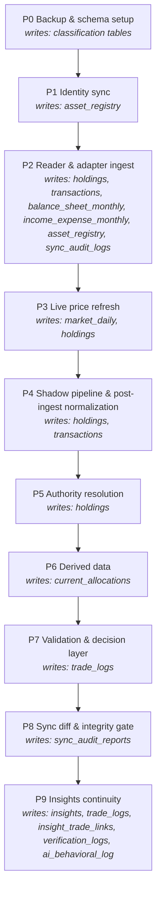

# Huinsight Data Pipeline — Flow Reference (verified 2026-06-10)

> **Audience**: humans and agents maintaining the sync pipeline.
> **Status**: hand-verified against code + live DB during the Phase A1 audit
> ([`docs/audits/2026-06-pipeline-audit.md`](../audits/2026-06-pipeline-audit.md));
> updated for Phase A2 (declarative manifest, P0–P8). The authoritative phase
> registry is **`src/sync/phases/manifest.py` (PIPELINE_MANIFEST)** —
> `run_full_sync_v3()` iterates it. When this doc and the code disagree, the
> code wins — re-run `scripts/reconcile_readers.py` and
> `scripts/freshness_report.py` to re-verify.

## 1. End-to-end flow

```text
 SOURCE FILES (iCloud Finance dir)                 EXTERNAL APIs
 ┌────────────────────────────────┐        ┌──────────────────────────┐
 │ Individual-Positions-*.csv     │        │ yfinance  (US + FX)      │
 │ Individual_*_Transactions*.csv │        │ akshare   (CN funds)     │
 │ funding_transactions.xlsx      │        │ SGE       (gold)         │
 │ Gold_transactions.xlsx         │        └────────────┬─────────────┘
 │ Insurance_Portfolio.xlsx       │                     │ (later, P3)
 │ RSU_transactions.xlsx          │                     │
 │ Financial Summary_new.xlsx     │                     │
 └──────────────┬─────────────────┘                     │
                │ run_full_sync_v3()                    │
                ▼                                       │
 ┌─────────────────────────────────────────────┐        │
 │ P0  BACKUP & SCHEMA SETUP                   │        │
 │   create_backup("pre-sync-v3")              │        │
 │   create_classification_tables (idempotent) │        │
 ├─────────────────────────────────────────────┤        │
 │ P1  IDENTITY                                │        │
 │   sync_asset_registry → asset_registry      │        │
 ├─────────────────────────────────────────────┤        │
 │ P2  READER & ADAPTER INGEST                 │        │
 │   pre-reader backup, legacy prefix fixes    │        │
 │   for each of 6 sources:                    │        │
 │     sync_<src>()      reader+transformer    │        │
 │     _normalize_holdings_df()                │        │
 │     _normalize_transactions_df()  (dedup!)  │        │
 │     _upsert_holdings/_replace_transactions  │        │
 │     detect_and_persist_deltas()             │        │
 │   import-adapter staged rows                │        │
 │   _auto_register_new_assets                 │        │
 │   no-op backup cleanup + zero-ingest alert  │        │
 ├─────────────────────────────────────────────┤        │
 │ P3  LIVE PRICE REFRESH (the ONLY price path)◄────────┘
 │   MarketDataService.refresh_portfolio_      │
 │   prices() → market_daily + holdings price  │
 │   update (live FX USDCNY=X, fallback 7.0)   │
 ├─────────────────────────────────────────────┤
 │ P4  SHADOW PIPELINE + NORMALIZATION [writer1]│
 │   stale-reader (>7d + liquidated)           │
 │   non-tradable older snapshots              │
 │   Financial Summary older snapshots         │
 │   legacy PIS rows                           │
 │   UNKNOWN_/GOLD_PAPER_/BRK cleanup          │
 │   FIFO cost-basis backfill (native ccy)     │
 │   insurance cost = Σ premiums (qty := 1)    │
 │   zero-P&L for Property_/Pension_           │
 │   RSU price update                          │
 ├─────────────────────────────────────────────┤
 │ P5  AUTHORITY RESOLUTION  [writer 2]        │
 │   AuthorityResolver + HoldingsAggregator    │
 │   per (asset, snapshot_date): one winning   │
 │   source per source_authority.yaml; losers  │
 │   get is_shadow=TRUE                        │
 ├─────────────────────────────────────────────┤
 │ P6  DERIVED                                 │
 │   sync_current_allocations                  │
 ├─────────────────────────────────────────────┤
 │ P7  VALIDATE + DECISIONS                    │
 │   cost basis (1%) / allocations (5%) /      │
 │   divergence (10%) warnings                 │
 │   trade-log linking + backfill + scoring    │
 ├─────────────────────────────────────────────┤
 │ P8  SYNC DIFF & INTEGRITY GATE              │
 │   sync diff (alert >30% net worth Δ)        │
 │   run_integrity_checks — 15 checks,         │
 │   6 BLOCKING / 9 advisory                   │
 │   persist_sync_audit                        │
 ├─────────────────────────────────────────────┤
 │ P9  INSIGHTS CONTINUITY  [ADVISORY]         │
 │   bridge ai_insights → Decision Hub         │
 │   score_all_trades (verdict/outcome_pct)    │
 │   recompute_auto_links (±3d attribution)    │
 │   compute_verification_report (if >24 h)    │
 │   BehavioralMetricsComputer (90d window)    │
 │   failure → WARNING only, never sync fail   │
 └──────────────┬──────────────────────────────┘
                ▼
 ┌─────────────────────────────────────────────┐
 │ DuckDB data/unified.duckdb                  │
 │  holdings        (time-series spine)        │
 │  transactions    (point events)             │
 │  market_daily    (OHLCV per code+date)      │
 │  balance_sheet_monthly / income_expense_    │
 │  asset_registry / taxonomy_classes          │
 │  trade_logs / insights (AI decision layer)  │
 │  sync_audit_logs / sync_audit_reports       │
 └──────────────┬──────────────────────────────┘
                ▼
   FastAPI (port 8008, routes have NO /api prefix)
                ▼
   React ux-command-center (port 5003, vite proxy /api/* → /*)
```

<!-- BEGIN AUTO-GENERATED PIPELINE DIAGRAM (scripts/generate_pipeline_diagram.py) -->


| Phase | Runner | Reads | Writes |
|---|---|---|---|
| **P0 Backup & schema setup** | `_run_phase0_backup_and_setup` | — | classification tables |
| **P1 Identity sync** | `_run_phase1_identity` | config/settings.yaml | asset_registry |
| **P2 Reader & adapter ingest** | `_run_phase2_ingest` | source files, import_adapter_staged_rows | holdings, transactions, balance_sheet_monthly, income_expense_monthly, asset_registry, sync_audit_logs |
| **P3 Live price refresh** | `_run_phase3_price_refresh` | holdings | market_daily, holdings |
| **P4 Shadow pipeline & post-ingest normalization** | `_run_phase4_shadow_cleanup` | holdings, transactions | holdings, transactions |
| **P5 Authority resolution** | `_run_phase5_authority` | holdings, config/source_authority.yaml | holdings |
| **P6 Derived data** | `_run_phase6_derived` | holdings | current_allocations |
| **P7 Validation & decision layer** | `_run_phase7_validation` | holdings, transactions, trade_logs | trade_logs |
| **P8 Sync diff & integrity gate** | `_run_phase8_audit` | holdings, transactions | sync_audit_reports |
| **P9 Insights continuity** | `_run_phase9_insights_continuity` | ai_insights, insights, trade_logs, insight_trade_links, verification_logs, transactions, holdings | insights, trade_logs, insight_trade_links, verification_logs, ai_behavioral_log |
<!-- END AUTO-GENERATED PIPELINE DIAGRAM -->

## 2. Per-source ingestion map

| Source file | Reader (src/sources/) | source_system | Asset IDs | Currency | Quirks |
|---|---|---|---|---|---|
| `Individual-Positions-*.csv` + `Individual_*_Transactions_*.csv` | `schwab_reader.py` | `Schwab_CSV` | `US_STK_*` (ETFs remapped from `US_ETF_*` at normalize), `CASH_USD` | USD native | Cash row extracted from positions; **MoneyLink transfer rows dropped — date format `"as of"` unparseable (audit F1)** |
| `funding_transactions.xlsx` | `cn_fund_raw_processor.py` → `cn_fund_reader.py` | `CN_Fund_Excel` | `CN_FUND_<6-digit>` | CNY | Raw paste tabs → organized tabs (**writes to the workbook**); QDII ±2d snapshot window; dedup collapses identical rows (audit F2) |
| `Gold_transactions.xlsx` | `gold_reader.py` | `Gold_Excel` | per-account `GOLD_PAPER_<bank>` aggregated → `ALTS_Paper_Gold` at insert | CNY | snapshot_date = file mtime; txn dedup key includes `account` |
| `Insurance_Portfolio.xlsx` | `insurance_reader.py` | `Insurance_Excel` | `INS_<产品名称>` | CNY | premiums sheet melts wide→long; reader emits qty=0, pipeline sets qty=1 + cost=Σpremiums (audit F3) |
| `RSU_transactions.xlsx` | `rsu_reader.py` | `RSU_Excel` | `RSU_AMZN` | USD native | holdings derived from vest/sell txns; cost = vest price (intentional PIS divergence) |
| `Financial Summary_new.xlsx` | `financial_summary_reader.py` | `Financial_Summary_Excel` | `CASH_Deposit_*`, `CASH_Cash_CNY`, `Property_*`, `Wealth_*`, `Pension_*` | CNY | header at Excel row 4; raw rows → `balance_sheet_monthly`/`income_expense_monthly`; `melt_balance_sheet_to_holdings()` extracts 10 discrete assets via hardcoded ASSET_MAPPING; history to 2019, only latest per asset active |

## 3. What "latest" means (the four answers)

```text
Q: which number am I looking at?

 holdings row (active)            "reader truth, possibly re-priced"
 ├─ snapshot_date        ← when the SOURCE FILE last reported the asset
 ├─ quantity             ← always from the reader (file)
 ├─ market_price_unit    ← native ccy; overwritten by live refresh if newer
 ├─ market_value         ← ALWAYS CNY = qty × price × live FX
 ├─ price_updated_at/src ← when/where the live refresh last touched it
 ├─ cost_price_unit      ← FIFO from transactions (NOT the file's cost)
 └─ authority_source     ← which source wins for this asset
```

1. **Holdings**: latest = per-asset `MAX(snapshot_date)` **WHERE is_shadow=FALSE,
   per source** — never a global MAX (QDII funds legitimately lag 2+ days).
2. **Market prices**: latest `market_daily` row per code; the live refresh
   (P3) also writes `holdings.market_price_unit/market_value` and
   stamps `price_updated_at`. So an active holding's *value* can be newer than
   its *snapshot*.
3. **Derived data** (allocations, P&L, attribution): recomputed every sync from
   the latest active holdings — never stored stale.
4. **Run the report**: `.venv/bin/python scripts/freshness_report.py` prints
   all of the above per asset; `scripts/reconcile_readers.py` proves files ↔ DB.

## 4. The two `is_shadow` writers (why both exist)

| Writer | Stage | Meaning of `is_shadow=TRUE` | Reversible? |
|---|---|---|---|
| Shadow pipeline | P4 | "this row is OBSOLETE" — older snapshot, liquidated stale position, or legacy PIS baseline | No — permanent archival |
| Authority resolution | P5 | "this row LOST the source conflict" — another source is authoritative for the asset on this date | Re-evaluated each sync per `config/source_authority.yaml` |

Same column, two meanings. Consequence for queries: `is_shadow=FALSE` means
"active AND authoritative". Workstream C (multi-broker co-authority) will
change writer 2 so that **multiple** sources can stay active per asset
(Schwab + IBKR both holding the same ticker) — see ADR-016 (planned).

## 5. Post-insertion mutations (why DB ≠ file, by design)

A reader's numbers are mutated after insertion by exactly these steps:

1. **Live price refresh** — `market_price_unit`, `market_value` (live FX vs
   the readers' static 7.0), `price_updated_at`, `price_source`.
2. **FIFO backfill** — `cost_price_unit` computed from transaction history in
   native currency (file-supplied cost is not authoritative).
3. **Insurance cost** — `cost_price_unit = Σ premium payments`, qty set to 1.
4. **Zero-P&L policy** — `Property_*`/`Pension_*`: cost := market value.
5. **Gold rollup** — per-bank `GOLD_PAPER_*` rows → single `ALTS_Paper_Gold`.
6. **Transaction dedup** — exact (date, asset, type, amount) duplicates
   collapsed (`keep="last"`; Gold also keys on `account`).

`scripts/reconcile_readers.py` whitelists exactly these as EXPLAINED; anything
else it reports is a real bug.

## 6. Integrity gate (Phase 6)

14 self-derived checks in `src/validation/data_integrity_gate.py`;
**blocking** (sync `success=False`): no-raw-USD-in-values, active-holdings-
positive, shadow-mutual-exclusion, cost-ratio<10×, reader-rows-not-all-
shadowed. The other 9 are advisory (`degraded=True`). CLI:
`python main.py --check-integrity [--json]`.

## 7. Known issues & where they're fixed

| # | Issue | Evidence | Fix planned |
|---|---|---|---|
| 1 | ~~Dead DSA SQLite price path runs before the real refresh~~ | **FIXED in A2** — removed from orchestrator; one-off backfill: `main.py --sync-market` | done |
| 2 | ~~Phase numbering: duplicate labels, no Phase 5, comments-only registry~~ | **FIXED in A2** — `src/sync/phases/manifest.py` PIPELINE_MANIFEST (P0–P8) | done |
| 3 | Schwab cash transfers (~$141K) silently dropped by date parsing | audit F1 | **B** (Schwab reader v2) |
| 4 | Hardcoded sheet/column/type maps in all 6 readers; format change = code surgery | audit, exploration | **B1/B2** (YAML config-driven readers) |
| 5 | CN Fund workbook has 2 duplicate txn rows (DB correct via dedup) | audit F2 | human fixes file; **B** raw-processor warning |
| 6 | Two CN fund holdings never price-refreshed | audit F4 | **A2** investigation |
| 7 | Single-winner authority can't express two brokers holding one ticker | source_authority.yaml | **C0/C3** (co-authority, ADR-016) |
| 8 | `data-pipeline-v4.md` stale (V5.6.1 labels vs V6.0.0 code) | audit F5 | **A3/A4** (generated diagram + doc v6) |

## 8. Operational quick reference

```bash
python main.py --sync-v3                          # full pipeline (backup first, automatic)
python main.py --sync-market                      # live prices only
python main.py --check-integrity                  # 14 invariants
.venv/bin/python scripts/reconcile_readers.py     # files ↔ DB proof (read-only)
.venv/bin/python scripts/freshness_report.py      # what's latest, per asset (read-only)
```

Rules that protect this pipeline: `AGENTS.md` (all rules; Rule 13 is the pipeline change
protocol) and the DB safety section in `CLAUDE.md` — read both before touching `src/sync/`
or `src/sources/`.
